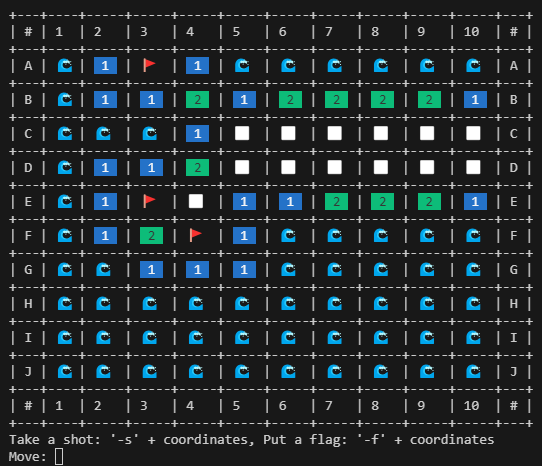
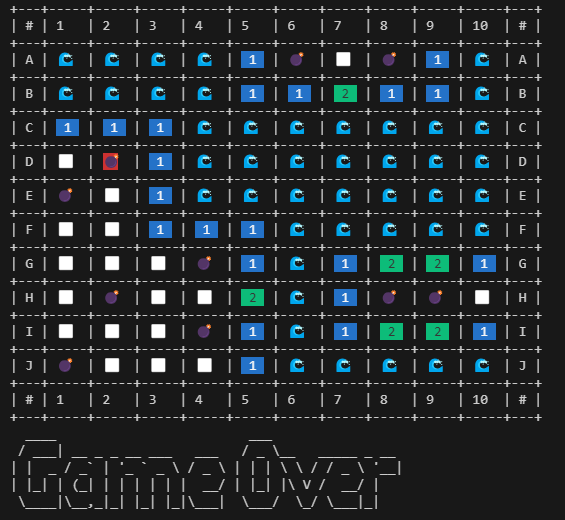

# Sapper Game
#### Video Demo:  <URL HERE>
#### Description:
Sapper game you can play in terminal window.

Find all bombs without any mistake. To win a game you need to reveal all squeres without a bomb or correctly put a flag on every bomb.

Moves:
- To shoot you need to input '-s' followed by square coordinates i.e. '-s B4'.
- You can mark a squere where you think a bomb is with a flag by inputing '-f' followed by coordinates i.e. '-f B4'.
- You can exit the game anytime by presing 'Ctrl' + 'D'.

#### Requirements:

Make shure you have installed following libraries before playing
- tabulate[widechars]
- pyfiglet
- numpy
- colorama
